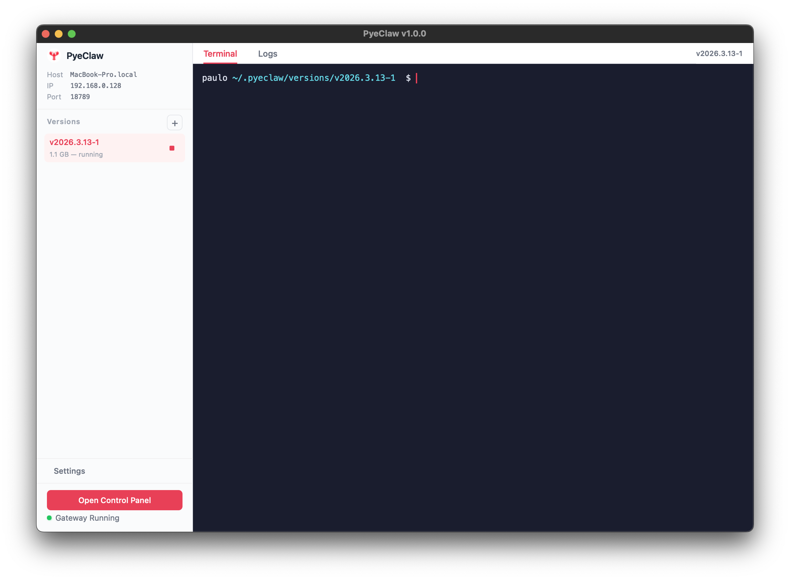

# PyeClaw

<p align="center">
    <a href="https://github.com/paulocoutinhox/pyeclaw" target="_blank" rel="noopener noreferrer">
        
    </a>
</p>

<p align="center">
    <a href="https://github.com/paulocoutinhox/pyeclaw/actions/workflows/build.yml"></a>
    <a href="https://github.com/paulocoutinhox/pyeclaw/releases/latest"></a>
    <a href="https://github.com/paulocoutinhox/pyeclaw/releases/latest"></a>
    <a href="https://github.com/paulocoutinhox/pyeclaw/blob/main/LICENSE.md"></a>
</p>

<p align="center">
    Desktop manager for <a href="https://github.com/openclaw/openclaw">OpenClaw</a>.<br>
    Install, update, and manage OpenClaw versions with a single click.
</p>

<p align="center">
    Built-in terminal · Gateway control · Version management · Cross-platform
</p>

---

## What is PyeClaw?

PyeClaw is a desktop application that makes it easy to manage [OpenClaw](https://github.com/openclaw/openclaw) on your computer. It provides a graphical interface so you don't need to use the command line.

With PyeClaw you can:

- **Install and remove** OpenClaw versions with one click
- **Start and stop** the OpenClaw gateway directly from the app
- **Monitor logs** in real time to see what's happening
- **Use the built-in terminal** for advanced operations
- **Access the control panel** through your browser when the gateway is running

## Download

Go to the [Releases](https://github.com/paulocoutinhox/pyeclaw/releases/latest) page and download for your operating system:

| Platform | Format | Architecture |
|----------|--------|-------------|
| macOS    | `.tar.gz` (contains `.app`) | arm64 |
| Linux    | `.tar.gz` | x86_64 |
| Windows  | `.zip` | x86_64 |

> **macOS note:** The app is signed and notarized by Apple. Just extract, drag to Applications, and open.

## Getting Started

1. Download and extract PyeClaw for your platform
2. Open the application
3. Click **Install Latest** to download the most recent OpenClaw version
4. Click the **play button** on a version to launch the gateway
5. Click **Open Control Panel** to access OpenClaw from your browser

That's it — no terminal commands needed.

## Development

### Requirements

- [Python](https://www.python.org/) 3.11+
- [uv](https://docs.astral.sh/uv/) (recommended) or pip

### Setup

```bash
git clone https://github.com/paulocoutinhox/pyeclaw.git
cd pyeclaw
make install
```

### Commands

```
make install       Install dependencies
make run           Run in development mode
make build         Build with PyInstaller
make publish       Build and create distributable archive
make lint          Run linting checks (ruff)
make clean         Remove build artifacts
make set-version   Set app version (VERSION=x.y.z)
```

### Project Structure

```
pyeclaw/
├── app.py                  Application entry point
├── config.py               Constants (colors, paths, fonts)
├── __main__.py             Module entry point
├── gui/                    UI components (PySide6)
│   ├── assets.py               Centralized image loader
│   ├── main_window.py          Main application window
│   ├── sidebar.py              Version list and gateway status
│   ├── terminal.py             Built-in terminal emulator (pyte)
│   ├── gateway_log.py          Gateway log viewer
│   ├── splash_screen.py        First-run welcome screen
│   ├── settings_panel.py       Settings with tabs (Gateway, Data, About)
│   ├── loading_overlay.py      Loading spinner overlay
│   ├── toast.py                Toast notifications
│   ├── confirm_dialog.py       Confirmation dialogs
│   └── version_modal.py        Version selection modal
├── service/                Business logic
│   ├── config_manager.py       Config persistence (JSON)
│   ├── http.py                 HTTP client with SSL (certifi)
│   ├── version_manager.py      Version download and install
│   └── openclaw_runner.py      Gateway process management
└── resources/              App icons
```

### Tech Stack

- **Python 3.11+** — Language
- **PySide6** — Qt for Python (UI framework)
- **pyte** — Pure Python VT100 terminal emulator
- **certifi** — SSL certificates for HTTPS
- **PyInstaller** — Application packaging
- **ruff** — Linting and formatting
- **uv** — Dependency management

## Documentation

- [Getting Started](docs/getting-started.md) — Installation and first run
- [Configuration](docs/configuration.md) — Gateway port, data directories
- [OpenClaw Setup](docs/openclaw-setup.md) — Setting up API keys (OpenAI, Anthropic)

### Deploy

- [macOS](docs/deploy-macos.md) — Build, sign, notarize, distribute
- [Windows](docs/deploy-windows.md) — Build, sign, distribute
- [Linux](docs/deploy-linux.md) — Build, package, distribute

## Screenshots

<p align="center">
    
</p>

## License

See [LICENSE](LICENSE.md) for details.

## Links

- [GitHub](https://github.com/paulocoutinhox/pyeclaw) · [Issues](https://github.com/paulocoutinhox/pyeclaw/issues) · [Releases](https://github.com/paulocoutinhox/pyeclaw/releases)

Made by [Paulo Coutinho](https://github.com/paulocoutinhox)
